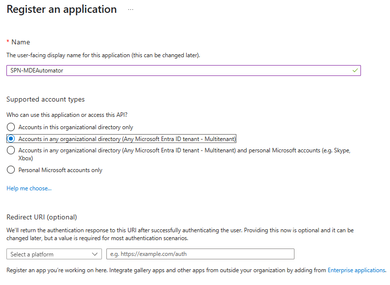
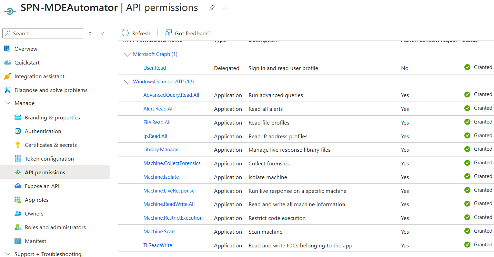
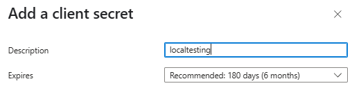

# MDEAutomator RC1


MDEAutomator is a modular, serverless solution for endpoint management and incident response in Microsoft Defender for Endpoint (MDE) environments. It leverages Azure Function Apps and a custom PowerShell module to orchestrate large MDE deployments, automate response actions, and manage threat indicators at scale.


## Core Components

- **MDEAutomator PowerShell Module**  
  Provides cmdlets for authentication, device management, live response, response actions, and threat indicator management in MDE.

- **Azure Function Apps**  
  - **MDEDispatcher**: Automates bulk management of response actions delivered to endpoints.
  - **MDEOrchestrator**: Automates bulk management of Live Response commands delivered to endpoints.
  - **MDEProfiles**: Automates bulk delivery of custom PowerShell scripts to configure policy on MDE endpoints.
  - **MDETIManager**: Automates the management of Threat Indicators in MDE.

## Key Features

- Portable PowerShell module
- Bulk automation of MDE response actions and live response actions
- Bulk management of MDE threat indicators (IOCs)
- Designed for multi-tenant use cases
- Azure Key Vault secret management + manual `$SPNSECRET` flexibility
- Ability to deliver key configuration settings not available in Endpoint Security Profiles via PowerShell
- Convenient upload of endpoint packages/files to Azure Storage

## Azure Resources Deployed

- Application Insights
- Azure Function (Premium)
- App Service Plan (EP1)
- Azure Storage
- Azure Key Vault
- Log Analytics Workspace (internal)
- User Managed Identity

MDEAutomator Estimated Monthly Azure Cost: ~$180 USD

## Prerequisites

1. Create Entra ID Service Principal (App Registration)  
   

   > **Note:** Select Multitenant if you plan to leverage this to service multiple tenants.

2. Add required API permissions to the Service Principal  
   

   Required WindowsDefenderATP API Permissions:

   - AdvancedQuery.Read.All
   - Alert.Read.All
   - File.Read.All
   - Ip.Read.All
   - Library.Manage
   - Machine.CollectForensics
   - Machine.Isolate
   - Machine.LiveResponse
   - Machine.Offboard
   - Machine.ReadWrite.All
   - Machine.RestrictExecution
   - Machine.Scan
   - Ti.ReadWrite

3. Generate SPN Secret (securely store for post-deployment configuration)  
   

4. Enable Unsigned Script Execution & Live Response for Servers and Workstations in MDE Advanced Settings. (See Security Notes section of this README)  
   

## Deployment

1. Click the "Deploy to Azure" button below.

   [](https://portal.azure.com/#create/Microsoft.Template/uri/https%3A%2F%2Fraw.githubusercontent.com%2Fmsdirtbag%2FMDEAutomator%2Frefs%2Fheads%2Fmain%2FIaC%2FMDEAutomator.json)

   

   > **Note:** After deployment, you may need to restart the Azure Function for the Function Apps to load properly.

2. Add "SPNSECRET" to Azure Key Vault

   Steps:

   a. Enable public access to MDEAutomator's Azure Key Vault

   b. Create a secret named "SPNSECRET" with the value generated during SPN provisioning  
      

   c. Disable public access to Azure Key Vault

3. Configure your front-end application to call the Function Apps

## Integration

- [Calling Azure Functions via HTTP](https://learn.microsoft.com/en-us/azure/azure-functions/functions-bindings-http-webhook-trigger)
- [Example Requests](https://github.com/msdirtbag/MDEAutomator/tree/main/tests)
- [How to customize and republish](https://learn.microsoft.com/en-us/azure/azure-functions/run-functions-from-deployment-package#manually-uploading-a-package-to-blob-storage)

## Use Cases

- Use the PowerShell module locally for bulk automation and investigation tasks.
- Use the PowerShell module in Azure Functions.
- Use the PowerShell module in Azure Automation.

## Usage

Below are example usage patterns for the MDEAutomator PowerShell module.


### Importing
```powershell
# Import MDEAutomator module
Import-Module -Name ./MDEAutomator -ErrorAction Stop -Force

```
> **Note:** PowerShell Gallery support is planned & in-progress

### Authentication Examples

```powershell
# Option 1: Using SecureString for SPN Secret and specifying TenantId
$token = Connect-MDE -SpnId "<AppId>" -SpnSecret (Read-Host -AsSecureString) -TenantId "<TenantId>"

# Option 2: Using SecureString for SPN Secret (defaults to home tenant)
$token = Connect-MDE -SpnId "<AppId>" -SpnSecret (Read-Host -AsSecureString)

# Option 3: Retrieving SPNSECRET from Azure Key Vault (requires Key Vault access)
$token = Connect-MDE -SpnId "<AppId>" -keyVaultName "<KeyVaultName>"

# Option 4: Retrieving SPNSECRET from Azure Key Vault and specifying TenantId
$token = Connect-MDE -SpnId "<AppId>" -TenantId "<TenantId>" -keyVaultName "<KeyVaultName>"
```

### Common Operations

```powershell
# Upload a file to the Live Response library (limit: 250 MB)
Invoke-UploadLR -token $token -filePath "C:\MDEAutomator\tester.txt"

# Push a Live Response Library file to endpoint devices
Invoke-PutFile -token $token -fileName "Active.ps1" -DeviceIds @("<DeviceId>")

# Run a full disk scan on multiple devices
Invoke-FullDiskScan -token $token -DeviceIds @("<DeviceId1>", "<DeviceId2>")

# Get a file from a device
Invoke-GetFile -token $token -filePath "C:\Windows\Temp\log.txt" -DeviceIds @("<DeviceId>")

# Collect an investigation package and upload to a storage account
Invoke-CollectInvestigationPackage -token $token -DeviceIds @("<DeviceId>") -StorageAccountName "<StorageAccount>"

# Run a script via Live Response
Invoke-LRScript -token $token -DeviceIds @("<DeviceId>") -scriptName "Active.ps1"

# Get all onboarded and active Windows machines
Get-Machines -token $token -filter "contains(osPlatform, 'Windows')"

# Get recent machine actions (last 90 days)
Get-Actions -token $token

# Cancel all current pending machine actions
Undo-Actions -token $token
```

### Response Actions

```powershell
# Isolate endpoints from the network
Invoke-MachineIsolation -token $token -DeviceIds @("<DeviceId>")

# Release endpoints from isolation
Undo-MachineIsolation -token $token -DeviceIds @("<DeviceId>")

# Restrict application/code execution on a device
Invoke-RestrictAppExecution -token $token -DeviceIds "<DeviceId>"

# Remove application/code execution restriction
Undo-RestrictAppExecution -token $token -DeviceIds @("<DeviceId>")
```

### Threat Indicator Management

```powershell
# Block a file hash (SHA256) as a custom threat indicator
Invoke-TiFile -token $token -Sha256s @("<SHA256>")

# Remove a file hash threat indicator
Undo-TiFile -token $token -Sha256s @("<SHA256>")

# Block an IP address as a threat indicator
Invoke-TiIP -token $token -IPs @("<IPAddress>")

# Remove an IP address threat indicator
Undo-TiIP -token $token -IPs @("<IPAddress>")

# Block a domain or URL as a threat indicator
Invoke-TiURL -token $token -URLs @("<DomainOrUrl>")

# Remove a domain or URL threat indicator
Undo-TiURL -token $token -URLs @("<DomainOrUrl>")

# Block a certificate thumbprint as a threat indicator
Invoke-TiCert -token $token -Sha1s @("<SHA1Thumbprint>")

# Remove a certificate thumbprint threat indicator
Undo-TiCert -token $token -Sha1s @("<SHA1Thumbprint>")
```

### Device Offboarding and File Download

```powershell
# Offboard a device from Defender for Endpoint
Invoke-MachineOffboard -token $token -DeviceIds @("<DeviceId>")

# Download a file from a device and save locally
$downloadUrl = Invoke-GetFile -token $token -filePath "C:\Windows\Temp\log.txt" -DeviceIds @("<DeviceId>")
Invoke-WebRequest -Uri $downloadUrl -OutFile "C:\Temp\log.txt"
```

## Security Notes

MDEAutomator could be misused by a threat actor and quickly become a weapon of mass destruction.

- Be mindful of secret management. Azure Key Vault with public access disabled is highly recommended.
- Clone the repo and use an Azure Trusted Signing account to sign all PowerShell in this repo with **your** signing key. There is a signing script included in the payloads subfolder in the repo named `signscripts.ps1` that can assist with this. Once this is done, redeploy the zip with the signed PowerShell to the Azure Function. This allows you to disable unsigned script execution in MDE Advanced Settings with no loss of functionality.

[Azure Trusted Signing](https://learn.microsoft.com/en-us/azure/trusted-signing/quickstart)

> **Note:** At this time, Trusted Signing is only available to organizations based in the USA and Canada that have a verifiable history of three years or more.

---

## Disclaimer

This software is provided "as is", without warranty of any kind, express or implied. The author and contributors are not responsible for any damages, losses, or issues arising from the use of this software. Use at your own risk.

---

## Contributing

We welcome contributions! Please open an issue or submit a pull request on [GitHub](https://github.com/msdirtbag/MDEAutomator).

---

## Acknowledgements

Made possible by the BlueVoyant Digital Forensics & Incident Response team. For assistance, contact incident@bluevoyant.com.

## References

- [VS Code Deployment Guide](https://learn.microsoft.com/en-us/azure/azure-resource-manager/bicep/deploy-vscode)
- [Azure CLI Deployment Guide](https://learn.microsoft.com/en-us/azure/azure-resource-manager/bicep/deploy-cli)
- [Azure PowerShell Deployment Guide](https://learn.microsoft.com/en-us/azure/azure-resource-manager/bicep/deploy-powershell)
- [Azure Cloud Shell Deployment Guide](https://learn.microsoft.com/en-us/azure/azure-resource-manager/bicep/deploy-cloud-shell)
- [GitHub Actions Deployment Guide](https://learn.microsoft.com/en-us/azure/azure-resource-manager/bicep/deploy-github-actions)
