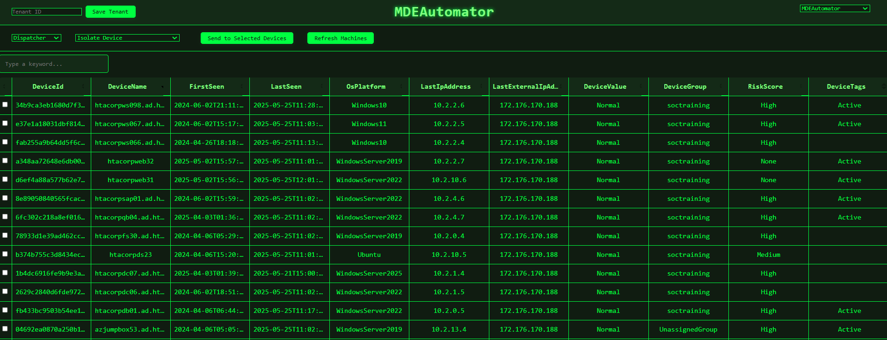
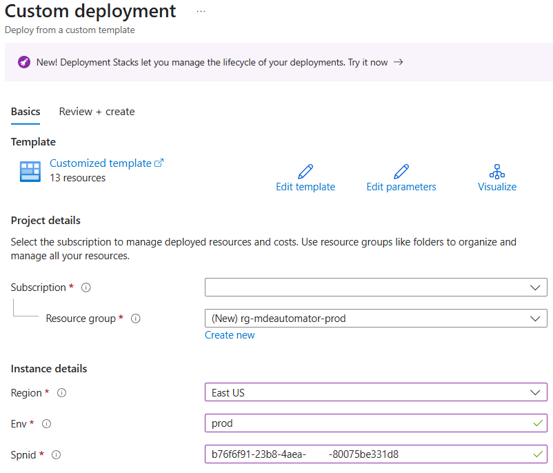
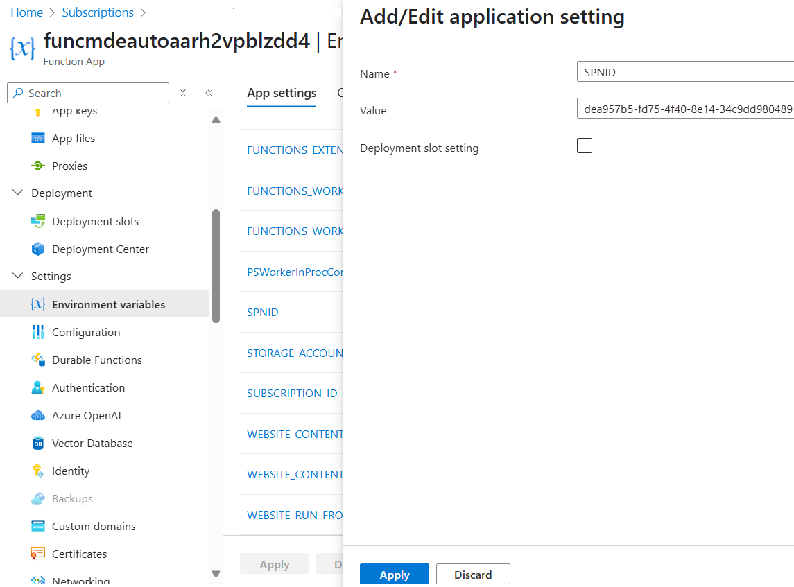

# MDEAutomator

MDEAutomator is a modular, serverless solution for endpoint management and incident response in Microsoft Defender for Endpoint (MDE) environments. It leverages Azure Function Apps and a custom PowerShell module to orchestrate MDE deployments.



---

## Core Components

- **MDEAutomator PowerShell Module**  
  Provides cmdlets for authentication, profile management, live response, response actions, custom detections, advanced hunting and threat indicator management in MDE.

- **Azure Function Apps**
  - **MDEDispatcher**  
    Automates bulk management of response actions delivered to endpoints:
    - `InvokeMachineIsolation`: Performs selective network isolation. (respects exclusion rules)
    - `UndoMachineIsolation`: Removes network isolation.
    - `InvokeContainDevice`: Instructs endpoints to deny all connections from this device.
    - `UndoContainDevice`: Restores communication with endpoints.
    - `UndoMachineIsolation`: Removes network isolation.
    - `InvokeRestrictAppExecution`: Enables Microsoft-only code integrity policy. (Microsoft-signed code only permitted to run)
    - `UndoRestrictAppExecution`- Removes Microsoft-only code integrity policy.
    - `InvokeCollectInvestigationPackage` - Collects Investigation Packages and uploads them to the `packages` blob container.
    - `InvokeStopAndQuarantineFile` - Searches for file on disk, encrypts the file and saves the file in the local WDAV quarantine folder.
    - `InvokeFullDiskScan` - Starts Full-disk WDAV scan jobs.
  - **MDEOrchestrator**  
    Automates bulk management of Live Response commands:
    - `InvokePutFile`- Pushes file from Live Response Library to 
    - `InvokeGetFile`- Retrieves file from endpoint and uploads to the `files` blob container.
    - `InvokeLRScript`- Runs live response script from Live Response Library on the endpoint.
  - **MDEProfiles**  
    Automates bulk delivery of custom PowerShell scripts to configure policy on MDE endpoints:
    - `Active`- This configures specific Set-MpPreference settings, registry settings, Attack Surface Reduction rules, Exploit Protection, and Windows Defender Application Control settings on endpoints. 
    - `Passive`- This configures specific Set-MpPreference settings and Attack Surface Reduction rules on endpoints.
  - **MDETIManager**  
    Automates management of Threat Indicators (IOCs) in Microsoft Defender for Endpoint:
    - `InvokeTiFile` / `UndoTiFile`: Creates/removes file hash-based indicators (SHA1/SHA256)
    - `InvokeTiIP` / `UndoTiIP`: Creates/removes IP address-based indicators
    - `InvokeTiURL` / `UndoTiURL`: Creates/removes URL and domain-based indicators
    - `InvokeTiCert` / `UndoTiCert`: Creates/removes certificate-based indicators (by thumbprint)
  - **MDEAutoHunt**  
    Automates bulk threat hunting and exports output to Azure Storage:
    - Relays groups of KQL queries to the MDE API, exports responses as JSON, and saves to Azure Storage.
  - **MDECDManager**  
    Automates synchronization of Custom Detections from a blob container:
    - Installs or updates Defender Custom Detections based on JSON files in the Detections blob container.

---

## Key Features

- Portable PowerShell module
- Bulk automation of MDE response actions and live response actions
- Bulk management of MDE threat indicators (IOCs)
- Designed for multi-tenant use cases
- Secretless App Registration/UMI auth + manual `$SPNSECRET` flexibility
- Ability to deliver key configuration settings via PowerShell that are not available in Endpoint Security Profiles. 
- Bulk Threat Hunting via Microsoft Graph
- Bulk Custom Detection syncronization from Azure Storage
- Convenient upload of endpoint packages/files to Azure Storage

---

## Azure Resources Deployed

- Application Insights
- Azure Function
- App Service Plan (EP1)
- Azure Storage
- User Managed Identity

MDEAutomator Estimated Monthly Azure Cost: ~$180 USD

---

## Deployment

1. Click the "Deploy to Azure" button below.

   [](https://portal.azure.com/#create/Microsoft.Template/uri/https%3A%2F%2Fraw.githubusercontent.com%2Fmsdirtbag%2FMDEAutomator%2Frefs%2Fheads%2Fmain%2FIaC%2FMDEAutomator.json)

   Note: You must specify a `env` parameter to make the deployment globally unique. Example: "dev", "test", etc.

   


2. Note the name of the User-Managed Identity that is created by the deployment.

---

## Activation

1. Download the activation script locally. 

   [Activation Script](https://github.com/msdirtbag/MDEAutomator/blob/main/payloads/addfedcred.ps1)


2. Run the script with Global Administrator or Cloud App Administator permissions active.

   Parameters:

   `-spnname` - The name of the App Registration that will be created for MDEAutomator
   `-uminame` - The name of the User Managed Identity that was created by the Deployment.


  Example usage:

  ```powershell
  ./addfedcred.ps1 -spnname "SPN-MDEAutomator" -uminame "umi-mdeautomator-n4pepfiqaxymu"
  ```

   Provisioned WindowsDefenderATP API Permissions:

   - AdvancedQuery.Read.All
   - Alert.Read.All
   - File.Read.All
   - Ip.Read.All
   - Library.Manage
   - Machine.CollectForensics
   - Machine.Isolate
   - Machine.StopAndQuarantine
   - Machine.LiveResponse
   - Machine.ReadWrite.All
   - Machine.RestrictExecution
   - Machine.Scan
   - Ti.ReadWrite.All
   - User.Read.All

   Provisioned Graph API Permissions:

   - CustomDetection.ReadWrite.All
   - ThreatHunting.Read.All
   - ThreatIndicators.ReadWrite.OwnedBy

   When the scripts complete, it will output the SpnId that must be saved as a Azure Function App Setting. 

3. Save the SpnId as a Azure Function App Setting.

   

4. Enable Unsigned Script Execution & Live Response for Servers and Workstations in MDE Advanced Settings. (See Security Notes section of this README)  

   

---

## Integration

- [Calling Azure Functions via HTTP](https://learn.microsoft.com/en-us/azure/azure-functions/functions-bindings-http-webhook-trigger)
- [Example Requests](https://github.com/msdirtbag/MDEAutomator/tree/main/tests)
- [How to customize and republish](https://learn.microsoft.com/en-us/azure/azure-functions/run-functions-from-deployment-package#manually-uploading-a-package-to-blob-storage)

---

## Use Cases

- Use the PowerShell module locally for bulk automation and investigation tasks.
- Use the PowerShell module in Azure Functions.
- Use the PowerShell module in Azure Automation.

---

## Module Introduction

Below are example usage patterns for the MDEAutomator PowerShell module.

### Installing & Importing
```powershell

# Import MDEAutomator module from source repo
Import-Module -Name ./function/MDEAutomator -ErrorAction Stop -Force

# Install & Import from PowerShell Gallery
Install-Module -Name MDEAutomator -AllowClobber -Force
Import-Module -Name MDEAutomator -ErrorAction Stop -Force
```
### Common Operations

```powershell
# Upload a file to the Live Response library (limit: 250 MB)
Invoke-UploadLR -token $token -filePath "C:\MDEAutomator\tester.txt"

# Push a Live Response Library file to endpoint devices
Invoke-PutFile -token $token -fileName "Active.ps1" -DeviceIds @("<DeviceId>")

# Run a full disk scan on all onboarded and active devices
$DeviceIds = Get-Machines -token $token | Select-Object -ExpandProperty Id
Invoke-FullDiskScan -token $token -DeviceIds $DeviceIds

# Run a script via Live Response on a single device and print the transcript in JSON
$DeviceId = "<DeviceId>"
$result = Invoke-LRScript -DeviceIds @($DeviceId) -scriptName 'Active.ps1' -token $token
$result | ConvertTo-Json -Depth 5 | Write-Host

# Download the file locally
$result = Invoke-GetFile -token $token -filePath "C:\Temp\test.msi" -DeviceIds @("<DeviceId>")
$downloadPath = "C:\Your\Desired\Path\test.msi.gz"
Invoke-WebRequest -Uri $result.FileUrl -OutFile $downloadPath

# Run Script on every device
$DeviceIds = Get-Machines -token $token | Select-Object -ExpandProperty Id
Invoke-LRScript -DeviceIds $DeviceIds -scriptName 'Active.ps1' -token $token

# Get all onboarded and active Windows machines
Get-Machines -token $token -filter "contains(osPlatform, 'Windows')"

# Get recent machine actions (last 90 days)
Get-Actions -token $token

# Cancel all current pending machine actions
Undo-Actions -token $token

# Retrieve all devices with a specific tag
$taggedDevices = Get-Machines -token $token -filter "contains(machineTags, 'Critical')"

# Restrict application execution on all endpoints with a high risk score
$highRiskDevices = Get-Machines -token $token -filter "riskScore eq 'High'" | Select-Object -ExpandProperty Id
Invoke-RestrictAppExecution -token $token -DeviceIds $highRiskDevices

# Get the status of all recent machine actions and export to CSV
Get-Actions -token $token | Export-Csv -Path "C:\Temp\MDEActions.csv" -NoTypeInformation

# Upload CSV of SHA256 hash values to MDE
$hashes = Import-Csv -Path "C:\Temp\hashes.csv" | Select-Object -ExpandProperty Sha256
Invoke-TiFile -token $token -Sha256s $hashes

# Upload CSV of IP addresses to MDE as threat indicators
$ips = Import-Csv -Path "C:\Temp\ips.csv" | Select-Object -ExpandProperty IP
Invoke-TiIP -token $token -IPs $ips

# Upload CSV of URLs or domains to MDE as threat indicators
$urls = Import-Csv -Path "C:\Temp\urls.csv" | Select-Object -ExpandProperty URL
Invoke-TiURL -token $token -URLs $urls

```
## Security Notes

> ⚠️ **Warning:**  
> MDEAutomator is a powerful tool that, if misused by a threat actor, could cause significant harm. Treat all credentials, scripts, and deployments with the highest level of security.

### PowerShell Security Hygiene

- **Sign all PowerShell scripts:**  
  Clone this repository and use an [Azure Trusted Signing](https://learn.microsoft.com/en-us/azure/trusted-signing/quickstart) account to sign every PowerShell script with your own signing key.
- A signing script (`signscripts.ps1`) is included in the `payloads` subfolder to assist with this process.
- After signing, redeploy the zip package containing the signed scripts to your Azure Function.
- This allows you to **disable unsigned script execution** in MDE Advanced Settings without losing any functionality.

> **Note:**  
> Azure Trusted Signing is currently available only to organizations based in the USA and Canada with a verifiable history of three years or more.

---

## Disclaimer

This software is provided "as is", without warranty of any kind, express or implied. The author and contributors are not responsible for any damages, losses, or issues arising from the use of this software. Use at your own risk.

---

## Contributing

We welcome contributions! Please open an issue or submit a pull request on [GitHub](https://github.com/msdirtbag/MDEAutomator).

---

## Acknowledgements

Made possible by the BlueVoyant Digital Forensics & Incident Response team. For assistance, contact incident@bluevoyant.com.

---

## References

- [VS Code Deployment Guide](https://learn.microsoft.com/en-us/azure/azure-resource-manager/bicep/deploy-vscode)
- [Azure CLI Deployment Guide](https://learn.microsoft.com/en-us/azure/azure-resource-manager/bicep/deploy-cli)
- [Azure PowerShell Deployment Guide](https://learn.microsoft.com/en-us/azure/azure-resource-manager/bicep/deploy-powershell)
- [Azure Cloud Shell Deployment Guide](https://learn.microsoft.com/en-us/azure/azure-resource-manager/bicep/deploy-cloud-shell)
- [GitHub Actions Deployment Guide](https://learn.microsoft.com/en-us/azure/azure-resource-manager/bicep/deploy-github-actions)

---

#### Module Documentation

## 1. Connect-MDE

**Description:**  
Authenticates to Microsoft Defender for Endpoint (MDE) using a Service Principal, optionally retrieving secrets from Azure Key Vault.

The `-SpnId` parameter is the Application (client) ID of your Azure Service Principal. This value uniquely identifies the app registration in Entra ID (Azure AD) that will be used for authentication. You can find this value in the Azure portal under your App Registration's overview page.

The `-SpnSecret` parameter is the client secret associated with your Service Principal. This should be provided as a secure string. Always store and handle this secret securely.

The `-ManagedIdentityId` parameter specifies the Client ID of the User Managed Identity associated with MDEAutomator. 

The `-TenantId` parameter is the Entra ID tenant ID where your Service Principal is registered. This is typically a GUID. If not specified, the module will use the tenant associated with your current Azure context.

**Parameters:**
- `-SpnId` (string, required): Service Principal App ID.
- `-SpnSecret` (securestring, optional): Service Principal secret.
- `-ManagedIdentityId` (string, optional): The Client ID of the MDEAutomator User-Managed Identity.
- `-TenantId` (string, optional): Entra ID Tenant ID or default to home tenant.

**Example:**
```powershell
# Using UMI + Federated App Registration
$token = Connect-MDE -SpnId "<SPNappId>" -ManagedIdentityId "<UMIappId>"

# Using direct secret
$secureSecret = Read-Host "Enter Secret" -AsSecureString
$token = Connect-MDE -SpnId "<appId>" -SpnSecret $secureSecret -TenantId "<tenantId>"
```

## 2. Get-Machines

**Description:**  

`Get-Machines` retrieves a collection of devices that have communicated with Microsoft Defender for Endpoint. It supports OData V4 queries, allowing you to filter, sort, and page results.

**Parameters:**

The `$token` parameter is the OAuth2 access token you receive from the `Connect-MDE` function. You must call `Connect-MDE` first and use its output as the `-token` value for `Get-Machines` and all other API functions. These tokens typically expire every 60 minutes. 

- The `-filter` parameter lets you use OData `$filter` expressions on properties such as: `computerDnsName`, `id`, `version`, `deviceValue`, `aadDeviceId`, `machineTags`, `lastSeen`, `exposureLevel`, `onboardingStatus`, `lastIpAddress`, `healthStatus`, `osPlatform`, `riskScore`, and `rbacGroupId`. You can also use `$top` (up to 10,000) and `$skip` for paging results.

**Example:**
```powershell
$machines = Get-Machines -token $token
$machines | Format-Table ComputerDnsName, Id, OsPlatform
```

## 3. Get-Actions

**Description:**  
Retrieves recent MDE machine actions from the last (60) days performed in MDE.

**Parameters:**
The `$token` parameter is the OAuth2 access token you receive from the `Connect-MDE` function. You must call `Connect-MDE` first and use its output as the `-token` value for `Get-Actions` and all other API functions. These tokens typically expire every 60 minutes. 

**Example:**
```powershell
$actions = Get-Actions -token $token
$actions | Format-Table Id, Type, Status, ComputerDnsName
```

## 4. Undo-Actions

**Description:**  
`Undo-Actions` cancels all pending machine actions in Microsoft Defender for Endpoint. This is useful for stopping actions that are queued but not yet executed.

**Parameters:**

The `$token` parameter is the OAuth2 access token you receive from the `Connect-MDE` function. You must call `Connect-MDE` first and use its output as the `-token` value for `Undo-Actions` and all other API functions. These tokens typically expire every 60 minutes.

- `-token` (string, required): OAuth2 access token.

**Example:**
```powershell
Undo-Actions -token $token
```

## 5. Invoke-MachineIsolation / Undo-MachineIsolation

**Description:**  
`Invoke-MachineIsolation` isolates one or more devices from the network, except for connections required for Defender for Endpoint service communication. This always uses Selective isolation and respects Isolation exclusion rules.
`Undo-MachineIsolation` removes isolation from specified devices, restoring their normal network connectivity.

**Parameters:**

The `$token` parameter is the OAuth2 access token you receive from the `Connect-MDE` function. You must call `Connect-MDE` first and use its output as the `-token` value for these functions. These tokens typically expire every 60 minutes.

The `-DeviceIds` parameter is an array of device IDs that uniquely identify the target devices in Microsoft Defender for Endpoint. You can obtain these IDs by running the `Get-Machines` function and referencing the `Id` property in the results. Pass one or more device IDs as a string array (e.g., `@("deviceId1", "deviceId2")`) to target multiple devices in a single operation.

- `-token` (string, required): OAuth2 access token.
- `-DeviceIds` (string[], required): Array of device IDs to isolate or unisolate.

**Example:**
```powershell
Invoke-MachineIsolation -token $token -DeviceIds @("<deviceId1>", "<deviceId2>")
Undo-MachineIsolation -token $token -DeviceIds @("<deviceId1>")
```

## 6. Invoke-ContainDevice / Undo-ContainDevice

**Description:**  
`Invoke-ContainDevice` contains one or more unmanaged devices in Microsoft Defender for Endpoint, restricting their network connectivity to prevent lateral movement.  
`Undo-ContainDevice` removes containment from specified unmanaged devices, restoring their normal network connectivity.

**Parameters:**

The `$token` parameter is the OAuth2 access token you receive from the `Connect-MDE` function. You must call `Connect-MDE` first and use its output as the `-token` value for these functions. These tokens typically expire every 60 minutes.

The `-DeviceIds` parameter is an array of device IDs that uniquely identify the target devices in Microsoft Defender for Endpoint. Indentify the DeviceId of Unmanaged device you wish to Contain.

- `-token` (string, required): OAuth2 access token.
- `-DeviceIds` (string[], required): Array of device IDs to contain or uncontain.

**Example:**
```powershell
Invoke-ContainDevice -token $token -DeviceIds @("<deviceId>")
Undo-ContainDevice -token $token -DeviceIds @("<deviceId>")
```

## 7. Invoke-RestrictAppExecution / Undo-RestrictAppExecution

**Description:**  
`Invoke-RestrictAppExecution` restricts application execution on one or more devices, allowing only Microsoft-signed binaries to run.  
`Undo-RestrictAppExecution` removes this restriction, allowing normal application execution.

**Parameters:**

The `$token` parameter is the OAuth2 access token you receive from the `Connect-MDE` function. You must call `Connect-MDE` first and use its output as the `-token` value for these functions. These tokens typically expire every 60 minutes.

The `-DeviceIds` parameter is an array of device IDs that uniquely identify the target devices in Microsoft Defender for Endpoint. You can obtain these IDs by running the `Get-Machines` function and referencing the `Id` property in the results. Pass one or more device IDs as a string array (e.g., `@("deviceId1", "deviceId2")`) to target multiple devices in a single operation.

- `-token` (string, required): OAuth2 access token.
- `-DeviceIds` (string[], required): Array of device IDs to restrict or unrestrict.

**Example:**
```powershell
Invoke-RestrictAppExecution -token $token -DeviceIds @("<deviceId>")
Undo-RestrictAppExecution -token $token -DeviceIds @("<deviceId>")
```

## 8. Invoke-CollectInvestigationPackage

**Description:**  
`Invoke-CollectInvestigationPackage` collects an investigation package from one or more specified devices. The package contains forensic artifacts for further analysis.

**Parameters:**

The `$token` parameter is the OAuth2 access token you receive from the `Connect-MDE` function. You must call `Connect-MDE` first and use its output as the `-token` value for these functions. These tokens typically expire every 60 minutes.

The `-DeviceIds` parameter is an array of device IDs that uniquely identify the target devices in Microsoft Defender for Endpoint. You can obtain these IDs by running the `Get-Machines` function and referencing the `Id` property in the results. Pass one or more device IDs as a string array (e.g., `@("deviceId1", "deviceId2")`) to target multiple devices in a single operation.

- `-token` (string, required): OAuth2 access token.
- `-DeviceIds` (string[], required): Array of device IDs to collect packages from.

**Example:**
```powershell
Invoke-CollectInvestigationPackage -token $token -DeviceIds @("<deviceId>")
```

## 9. Invoke-TiFile / Undo-TiFile

**Description:**  
`Invoke-TiFile` creates file hash-based custom threat indicators in Microsoft Defender for Endpoint.  
`Undo-TiFile` deletes file hash-based custom threat indicators.

**Parameters:**

The `$token` parameter is the OAuth2 access token you receive from the `Connect-MDE` function. You must call `Connect-MDE` first and use its output as the `-token` value for these functions. These tokens typically expire every 60 minutes.

The `-Sha1s` and `-Sha256s` parameters are arrays of file hashes that you want to add or remove as custom threat indicators in Microsoft Defender for Endpoint. Each entry should be a valid SHA-1 or SHA-256 hash string. You can specify values for either or both parameters at the same time, and the function will process all provided hashes in a single operation. This allows you to efficiently manage multiple file-based indicators in one call.

- `-token` (string, required): OAuth2 access token.
- `-Sha1s` (string[], optional): Array of SHA1 hashes.
- `-Sha256s` (string[], optional): Array of SHA256 hashes.

**Example:**
```powershell
Invoke-TiFile -token $token -Sha1s @("<sha1>")
Undo-TiFile -token $token -Sha256s @("<sha256>")
```

## 10. Invoke-TiCert / Undo-TiCert

**Description:**  
`Invoke-TiCert` creates certificate thumbprint-based custom threat indicators in Microsoft Defender for Endpoint.  
`Undo-TiCert` deletes certificate thumbprint-based custom threat indicators.

**Parameters:**

The `$token` parameter is the OAuth2 access token you receive from the `Connect-MDE` function. You must call `Connect-MDE` first and use its output as the `-token` value for these functions. These tokens typically expire every 60 minutes.

The `-Sha1s` parameter is an array of certificate thumbprints that you want to add or remove as custom threat indicators in Microsoft Defender for Endpoint. Each entry must be a valid SHA-1 certificate thumbprint string. Note that MDE only accepts SHA-1 values for certificate thumbprints—other hash types are not supported. 

- `-token` (string, required): OAuth2 access token.
- `-Sha1s` (string[], required): Array of certificate thumbprints.

**Example:**
```powershell
Invoke-TiCert -token $token -Sha1s @("<thumbprint>")
Undo-TiCert -token $token -Sha1s @("<thumbprint>")
```

## 11. Invoke-TiIP / Undo-TiIP

**Description:**  
`Invoke-TiIP` creates IP address-based custom threat indicators in Microsoft Defender for Endpoint.  
`Undo-TiIP` deletes IP address-based custom threat indicators.

**Parameters:**

The `$token` parameter is the OAuth2 access token you receive from the `Connect-MDE` function. You must call `Connect-MDE` first and use its output as the `-token` value for these functions. These tokens typically expire every 60 minutes.

The `-IPs` parameter is an array of IP addresses that you want to add or remove as custom threat indicators in Microsoft Defender for Endpoint. Each entry should be a valid public IPv4 or IPv6 address (e.g., `"8.8.8.8"` or `"2001:4860:4860::8888"`). Private or reserved IP ranges are not supported. You can specify one or more IP addresses as a string array (e.g., `@("8.8.8.8", "1.1.1.1")`) to target multiple indicators in a single operation.

- `-token` (string, required): OAuth2 access token.
- `-IPs` (string[], required): Array of IP addresses.

**Example:**
```powershell
Invoke-TiIP -token $token -IPs @("8.8.8.8")
Undo-TiIP -token $token -IPs @("8.8.8.8")
```

## 12. Invoke-TiURL / Undo-TiURL

**Description:**  
`Invoke-TiURL` creates URL or domain-based custom threat indicators in Microsoft Defender for Endpoint.  
`Undo-TiURL` deletes URL or domain-based custom threat indicators.

**Parameters:**

The `$token` parameter is the OAuth2 access token you receive from the `Connect-MDE` function. You must call `Connect-MDE` first and use its output as the `-token` value for these functions. These tokens typically expire every 60 minutes.

The `-URLs` parameter is an array of URLs or domain names that you want to add or remove as custom threat indicators in Microsoft Defender for Endpoint. Each entry should be a valid URL or domain string (e.g., `"malicious.example.com"`). You can specify one or more URLs or domains as a string array (e.g., `@("malicious.example.com", "phishing.example.net")`) to target multiple indicators in a single operation.

- `-token` (string, required): OAuth2 access token.
- `-URLs` (string[], required): Array of URLs or domains.

**Example:**
```powershell
Invoke-TiURL -token $token -URLs @("malicious.example.com")
Undo-TiURL -token $token -URLs @("malicious.example.com")
```

## 13. Invoke-UploadLR

**Description:**  
`Invoke-UploadLR` uploads a script file to the Microsoft Defender for Endpoint Live Response library for later use in automated investigations or manual response.

**Parameters:**

The `$token` parameter is the OAuth2 access token you receive from the `Connect-MDE` function. You must call `Connect-MDE` first and use its output as the `-token` value for these functions. These tokens typically expire every 60 minutes.

The `-filePath` parameter specifies the full path to the script or file you want to upload or retrieve. For upload operations, provide the local path to the file on your system (e.g., `"C:\Scripts\MyScript.ps1"`). 

- `-token` (string, required): OAuth2 access token.
- `-filePath` (string, required): Path to the script file to upload.

**Example:**
```powershell
Invoke-UploadLR -token $token -filePath "C:\Scripts\MyScript.ps1"
```

## 14. Invoke-PutFile

**Description:**  
`Invoke-PutFile` pushes a file from the Live Response library to one or more specified devices.

**Parameters:**

The `$token` parameter is the OAuth2 access token you receive from the `Connect-MDE` function. You must call `Connect-MDE` first and use its output as the `-token` value for these functions. These tokens typically expire every 60 minutes.

The `-fileName` parameter specifies the name of the file in the Live Response library that you want to push to devices. This should match the exact file name as it appears in the library, including the file extension (e.g., `"MyScript.ps1"`). Ensure the file has already been uploaded to the library using the appropriate upload function before referencing it here.

The `-DeviceIds` parameter is an array of device IDs that uniquely identify the target devices in Microsoft Defender for Endpoint. You can obtain these IDs by running the `Get-Machines` function and referencing the `Id` property in the results. Pass one or more device IDs as a string array (e.g., `@("deviceId1", "deviceId2")`) to target multiple devices in a single operation.

- `-token` (string, required): OAuth2 access token.
- `-fileName` (string, required): Name of the file in the library.
- `-DeviceIds` (string[], required): Array of device IDs to receive the file.

**Example:**
```powershell
Invoke-PutFile -token $token -fileName "MyScript.ps1" -DeviceIds @("<deviceId>")
```

## 15. Invoke-GetFile

**Description:**  
`Invoke-GetFile` retrieves a file from one or more specified devices using Live Response.

**Parameters:**

The `$token` parameter is the OAuth2 access token you receive from the `Connect-MDE` function. You must call `Connect-MDE` first and use its output as the `-token` value for these functions. These tokens typically expire every 60 minutes.

The `-filePath` parameter specifies the full path to the script or file you want to upload or retrieve. For upload operations, provide the path to the file on the MDE endpoint. (e.g., `"C:\Temp\error.log"`)

The `-DeviceIds` parameter is an array of device IDs that uniquely identify the target devices in Microsoft Defender for Endpoint. You can obtain these IDs by running the `Get-Machines` function and referencing the `Id` property in the results. Pass one or more device IDs as a string array (e.g., `@("deviceId1", "deviceId2")`) to target multiple devices in a single operation.

- `-token` (string, required): OAuth2 access token.
- `-filePath` (string, required): Path to the file on the device.
- `-DeviceIds` (string[], required): Array of device IDs to retrieve the file from.

**Example:**
```powershell
Invoke-GetFile -token $token -filePath "C:\Windows\Temp\test.txt" -DeviceIds @("<deviceId>")
```

## 16. Invoke-LRScript

**Description:**  
`Invoke-LRScript` executes a Live Response script from the library on one or more specified devices.

**Parameters:**

The `$token` parameter is the OAuth2 access token you receive from the `Connect-MDE` function. You must call `Connect-MDE` first and use its output as the `-token` value for these functions. These tokens typically expire every 60 minutes.

The `-scriptName` parameter specifies the name of the file in the Live Response library that you want to push to devices. This should match the exact file name as it appears in the library, including the file extension (e.g., `"MyScript.ps1"`). Ensure the file has already been uploaded to the library using the appropriate upload function before referencing it here.

The `-DeviceIds` parameter is an array of device IDs that uniquely identify the target devices in Microsoft Defender for Endpoint. You can obtain these IDs by running the `Get-Machines` function and referencing the `Id` property in the results. Pass one or more device IDs as a string array (e.g., `@("deviceId1", "deviceId2")`) to target multiple devices in a single operation.

- `-DeviceIds` (string[], required): Array of device IDs to run the script on.
- `-scriptName` (string, required): Name of the script in the library.
- `-token` (string, required): OAuth2 access token.

**Example:**
```powershell
Invoke-LRScript -DeviceIds @("<deviceId>") -scriptName "MyScript.ps1" -token $token
```

## 17. Get-MachineActionStatus

**Description:**  
`Get-MachineActionStatus` checks the status of a machine action by its action ID.

**Parameters:**

The `$token` parameter is the OAuth2 access token you receive from the `Connect-MDE` function. You must call `Connect-MDE` first and use its output as the `-token` value for these functions. These tokens typically expire every 60 minutes.

The `-machineActionId` parameter is the unique identifier for a specific machine action in Microsoft Defender for Endpoint. You can obtain this value from the output of functions such as `Get-Actions` or after initiating an action (e.g., isolation, investigation package collection) and waiting for the response. Use this ID to query the status or retrieve the output of that particular action.


- `-machineActionId` (string, required): The machineActionId to check.
- `-token` (string, required): OAuth2 access token.

**Example:**
```powershell
Get-MachineActionStatus -machineActionId "<machineActionId>" -token $token
```

## 18. Get-LiveResponseOutput

**Description:**  
`Get-LiveResponseOutput` downloads and parses the output of a Live Response script for a given machine action.

**Parameters:**

The `$token` parameter is the OAuth2 access token you receive from the `Connect-MDE` function. You must call `Connect-MDE` first and use its output as the `-token` value for these functions. These tokens typically expire every 60 minutes.

The `-machineActionId` parameter is the unique identifier for a specific machine action in Microsoft Defender for Endpoint. You can obtain this value from the output of functions such as `Get-Actions` or after initiating an action (e.g., isolation, investigation package collection) and waiting for the response. Use this ID to query the status or retrieve the output of that particular action.

- `-machineActionId` (string, required): The machineActionId for the Live Response script.
- `-token` (string, required): OAuth2 access token.

**Example:**
```powershell
Get-LiveResponseOutput -machineActionId "<machineActionId>" -token $token
```

## 19. Invoke-StopAndQuarantineFile

**Description:**  
`Invoke-StopAndQuarantineFile` issues a Stop and Quarantine File action on one or more devices in Microsoft Defender for Endpoint. This action attempts to stop the specified file (by SHA1 hash) on all Active and onboarded devices.

**Parameters:**

- `-token` (string, required): OAuth2 access token. Obtain this from `Connect-MDE`.
- `-Sha1` (string, required): The SHA1 hash of the file to stop and quarantine.

**Example:**
```powershell
Invoke-StopAndQuarantineFile -token $token -Sha1 "<sha1hash>"
```

## 20. Get-Indicators

**Description:**  
`Get-Indicators` retrieves all custom threat indicators (IOCs) from Microsoft Defender for Endpoint, including file hashes, IPs, URLs, and certificates. 

**Parameters:**

- `-token` (string, required): OAuth2 access token. Obtain this from `Connect-MDE`.

**Example:**
```powershell
$indicators = Get-Indicators -token $token
$indicators | Format-Table Id, IndicatorValue, IndicatorType, Action
```
## 21. Get-FileInfo

**Description:**  
`Get-FileInfo` retrieves detailed information about one or more files in Microsoft Defender for Endpoint using their SHA1 hashes. For each hash, it returns file metadata, related alerts, machines, and statistics.

**Parameters:**

- `-token` (string, required): OAuth2 access token. Obtain this from `Connect-MDE`.
- `-Sha1s` (string[], required): Array of SHA1 hashes to query.

**Example:**
```powershell
$fileInfo = Get-FileInfo -token $token -Sha1s @("<sha1hash1>", "<sha1hash2>")
$fileInfo | ConvertTo-Json -Depth 5
```
## 22. Get-IPInfo

**Description:**  
`Get-IPInfo` retrieves information about one or more IP addresses from Microsoft Defender for Endpoint. For each IP, it returns related alerts, statistics, and advanced hunting results.

**Parameters:**

- `-token` (string, required): OAuth2 access token. Obtain this from `Connect-MDE`.
- `-IPs` (string[], required): Array of IP addresses to query.

**Example:**
```powershell
$ipInfo = Get-IPInfo -token $token -IPs @("8.8.8.8", "1.2.3.4")
$ipInfo | ConvertTo-Json -Depth 5
```

## 23. Get-URLInfo

**Description:**  
`Get-URLInfo` retrieves information about one or more URLs or domains from Microsoft Defender for Endpoint. For each URL or domain, it returns related alerts, statistics, machines, and advanced hunting results.

**Parameters:**

- `-token` (string, required): OAuth2 access token. Obtain this from `Connect-MDE`.
- `-URLs` (string[], required): Array of URLs or domains to query.

**Example:**
```powershell
$urlInfo = Get-URLInfo -token $token -URLs @("malicious.example.com", "phishing.example.net")
$urlInfo | ConvertTo-Json -Depth 5
```

## 24. Get-LoggedInUsers

**Description:**  
`Get-LoggedInUsers` retrieves the list of users currently or recently logged in to one or more devices in Microsoft Defender for Endpoint. For each device, it returns details such as account name, domain, logon type, session info, and last seen time.

**Parameters:**

- `-token` (string, required): OAuth2 access token. Obtain this from `Connect-MDE`.
- `-DeviceIds` (string[], required): Array of device IDs to query. Use `Get-Machines` to obtain IDs.

**Example:**
```powershell
$deviceIds = Get-Machines -token $token | Select-Object -ExpandProperty Id
$users = Get-LoggedInUsers -token $token -DeviceIds $deviceIds
$users | Format-Table DeviceId, AccountName, LogonTime, LastSeen
```

> **Tip:**  
> For most functions, ensure you have a valid `$token` from `Connect-MDE` and the required permissions in Azure/MDE.

## 25. Invoke-AdvancedHunting

**Description:**  
`Invoke-AdvancedHunting` runs one or more KQL queries against Microsoft Defender for Endpoint’s Advanced Hunting API using Microsoft Graph. It returns the raw results for each query.

It leverages a randomization technique to load balance between the v1.0 & Beta API endpoint.

**Requirements:**

You must be connected to Microsoft Graph using `Connect-MDE` before running this command.

**Parameters:**

- `-Queries` (string[], required): String Array of KQL queries to execute. Each query string should be valid KQL syntax.

**Example:**
```powershell
$queries = @(
    "DeviceEvents | take 5",
    "AlertInfo | where Severity == 'High'"
)
$results = Invoke-AdvancedHunting -Queries $queries
$results | ConvertTo-Json -Depth 5
```

## 26. Get-DetectionRules

**Description:**  
`Get-DetectionRules` retrieves all Microsoft Defender Custom Detection rules via Microsoft Graph API as objects.

**Requirements:**  
You must be connected to Microsoft Graph using `Connect-MDE` before running this command.

**Parameters:**  
_None._

**Example:**
```powershell
$rules = Get-DetectionRules
$rules | ConvertTo-Json -Depth 50
Write-Host $rules 
```

## 27. Install-DetectionRule

**Description:**  
`Install-DetectionRule` installs a new Custom Detection rule in Microsoft Defender via Microsoft Graph API. Accepts a PowerShell object representing the rule definition.

**Requirements:**  
You must be connected to Microsoft Graph using `Connect-MDE` before running this command.

**Parameters:**

- `-jsonContent` (PSCustomObject, required): The Custom Detection rule definition as a PowerShell object.

**Example:**
```powershell
$jsonContent = Get-Content .\MyDetectionRule.json | ConvertFrom-Json
Install-DetectionRule -jsonContent $jsonContent
```

## 28. Update-DetectionRule

**Description:**  
`Update-DetectionRule` updates an existing Custom Detection rule in Microsoft Defender via Microsoft Graph API. Accepts the rule ID and the updated rule definition.

**Requirements:**  
You must be connected to Microsoft Graph using `Connect-MDE` before running this command.

**Parameters:**

- `-RuleId` (string, required): The ID of the Custom Detection rule to update.
- `-jsonContent` (PSCustomObject, required): The updated Custom Detection rule definition as a PowerShell object.

**Example:**
```powershell
$jsonContent = Get-Content .\UpdatedDetectionRule.json | ConvertFrom-Json
Update-DetectionRule -RuleId $ruleId -jsonContent $jsonContent
```

## 29. Undo-DetectionRule

**Description:**  
`Undo-DetectionRule` deletes an existing Custom Detection rule in Microsoft Defender via Microsoft Graph API. Accepts the rule ID of the detection rule to remove.

**Requirements:**  
You must be connected to Microsoft Graph using `Connect-MDE` before running this command.

**Parameters:**

- `-RuleId` (string, required): The ID of the Custom Detection rule to delete.

**Example:**
```powershell
Undo-DetectionRule -RuleId $ruleId
```
